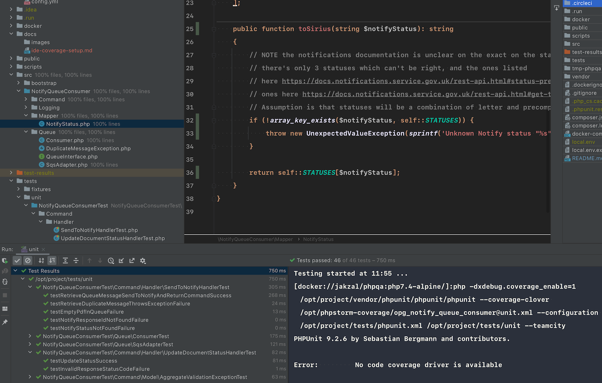
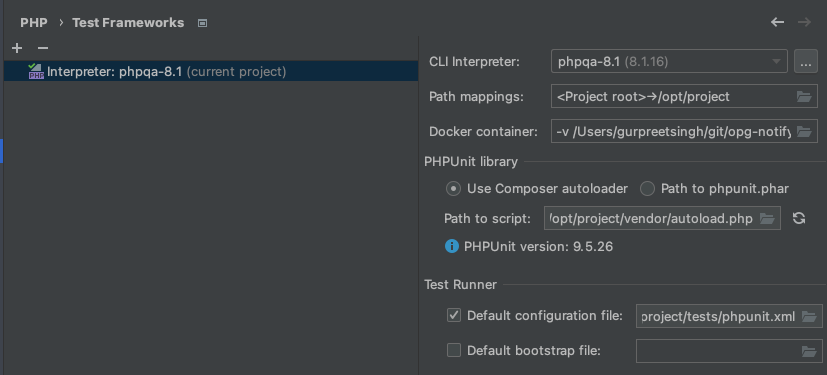

# IDE PHPUnit coverage integration setup

This guide walks through setting up PHPStorm/IntelliJ with PCov in order to get unit test coverage feedback inside your 
editor.



1. We're going to use the jakzal/phpqa image for running PHPUnit with PCov:
    ```
        docker pull jakzal/phpqa:php7.4-alpine
    ```

2. In your editor (either PHPStorm or IntelliJ), go to Preferences > Languages and Frameworks > PHP
3. Set "PHP language level" to 7.4
4. For "CLI Interpreter" hit the edit button (the three dots)
5. On the "CLI Interpreters" popup, add a new one, make it Docker and call it `phpqa-7.4`
6. Under "Image name", select `jakzal/phpqa:php7.4-alpine`
7. Go to Preferences > Languages and Frameworks > PHP > Test Frameworks
8. Add a new interpreter - selecting "PHPUnit by Remote Interpreter" (Please note, if you are using IntelliJ, you will need to install the Behat Support plugin to run this step)
9. Select `phpqa-7.4` (the one we created) as the interpreter
10. Your settings should then match these: 

11. In the top menu, go to Run > Edit Configurations
12. Add a new configuration, of a type "PHPUnit" call it "Test Project"
13. Settings:
    1. Test scope: "Defined in the configuration file"
    2. Test runner options: `--testsuite=unit`
    3. Preferred Coverage Engine: "PCov"
    4. Interpreter: Default project interpreter
    5. Interpreter options: `-dpcov.directory=/opt/project/`
14. Now when you go to Run or in the top toolbar (if you have it enabled) you can select 
"Run 'Test Project' with Coverage", and it will run the full test suite and generate a coverage report that integrates 
with your editor, so you can see the percentage of coverage in each class, with any code that isn't covered highlighted.


